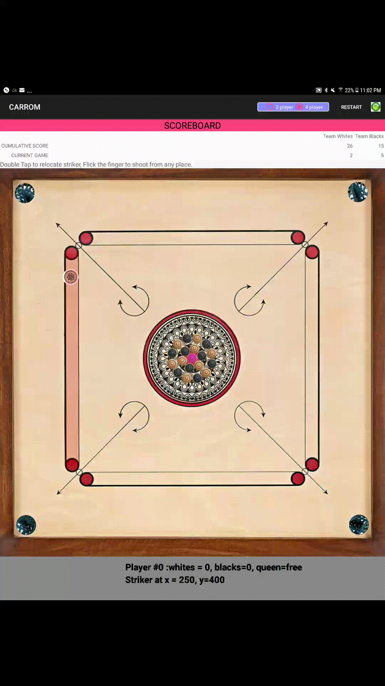
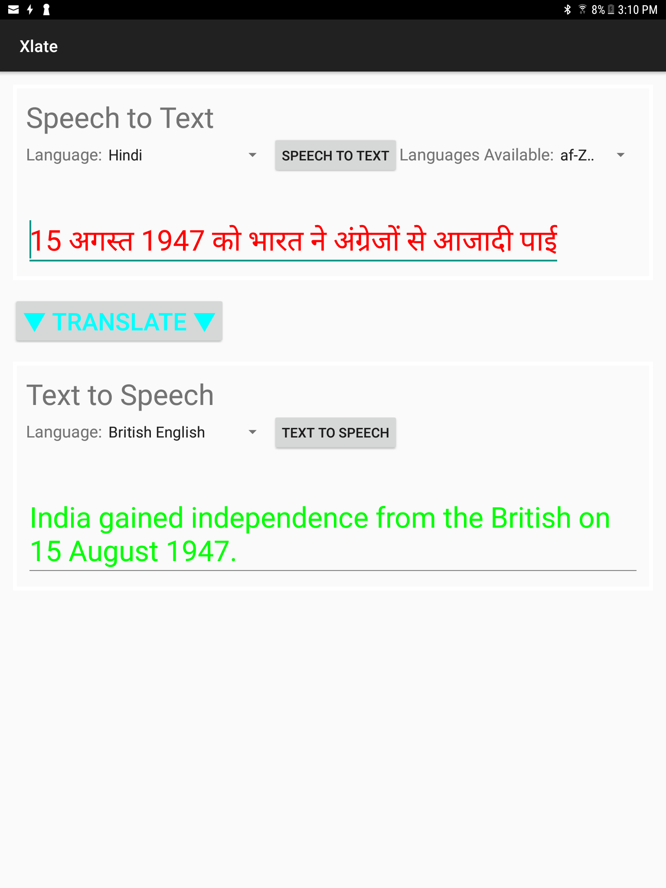
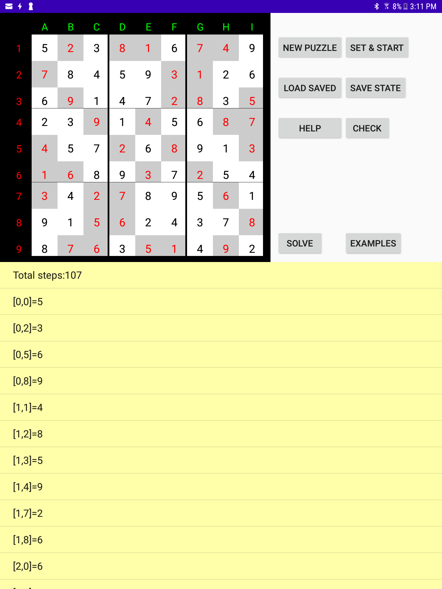

Interesting Apps 
1) Carrom, a game like billiards...The project showcases the use of painting and animation on a Graphic Surface including some cool Physics to simulate moving disks. The Physics includes conservation of Momentum with the heavy striker hitting the various lighter disks and simulating friction. The act of putting this on Google playstore was also quite educational.

2)Xlate, a simple speech to tect and text to speech translator using the API from Google.

3)Sudoku...Tied it to the Sudoku Solver puzzles algorith.

4) More to come...
Knights Tour, Word Boggle and Word Ladder animation by wiring up the Non-UI solution to the Graphic one for display.
